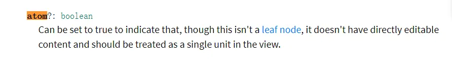

# ProseMirror 与云文档

上海・2024.07.24

[@fantasticit](https://github.com/fantasticit)

<!-- 第 2 页 -->
---

# 什么是 ProseMirror

> ProseMirror 是一个模块化的、可扩展的文本编辑器框架


- 灵活性: 可以根据需求定制编辑器功能。
- 性能: 高效的文档更新和渲染机制。
- 可扩展性: 支持插件和扩展。
- 社区: 活跃的开发者社区和丰富的资源。


<!-- 第 3 页 -->
---

# ProseMirror 基础示例

[链接](https://prosemirror.net/examples/basic/)

```javascript {9|10|15|16}{maxHeight: '200px'}
import {EditorState} from "prosemirror-state"
import {EditorView} from "prosemirror-view"
import {Schema, DOMParser} from "prosemirror-model"
import {schema} from "prosemirror-schema-basic"
import {addListNodes} from "prosemirror-schema-list"
import {exampleSetup} from "prosemirror-example-setup"

const mySchema = new Schema({
  nodes: addListNodes(schema.spec.nodes, "paragraph block*", "block"),
  marks: schema.spec.marks
})

window.view = new EditorView(document.querySelector("#editor"), {
  state: EditorState.create({
    doc: DOMParser.fromSchema(mySchema).parse(document.querySelector("#content")),
    plugins: exampleSetup({schema: mySchema})
  })
})
```

- 节点（Nodes）: 文档的基本结构单元，如段落、文本等
- 标记（Marks）: 文本的属性，如加粗、颜色等
- 文档（Document）: 整个文档的不可变数据结构
- 插件（Plugins）：应用于编辑器的插件

<!-- 第 4 页 -->
---

# ProseMirror 中的数据结构

[链接](https://prosemirror.net/)


核心概念：doc、nodes、marks

<!-- 第 5 页 -->
---

# Node

ProseMirror 的内容都是由 Node构成的。Node 类型只有两种，block与 inline，和 HTML 中类似概念差不多。


<!-- 第 5.1 页 -->
---

## 举个例子：Paragpah

```javascript {2|3|4|5|6|9|13}{maxHeight: '300px'}
export const Paragraph = Node.create<ParagraphOptions>({
  name: "paragraph",
  priority: 1000,
  group: "block",
  content: "inline*",
  marks: '_',

  parseHTML() {
    return [{ tag: "p" }];
  },

  renderHTML({ HTMLAttributes }) {
    return ["p", mergeAttributes(this.options.HTMLAttributes, HTMLAttributes), 0];
  },

  addCommands() {
    return {
      setParagraph:
        () =>
        ({ commands }) => {
          return commands.setNode(this.name);
        },
    };
  },

  addKeyboardShortcuts() {
    return {
      "Mod-Alt-0": () => this.editor.commands.setParagraph(),
    };
  },
});
```

<!-- 第 6 页 -->
---

## parseRule

Node 定义中的 parseDOM用于定义解析规则，DOMParser 在将 dom 转换为 node 时使用该规则进行解析。

典型场景：复制粘贴其他网页内容。

```javascript
parseHTML() {
  return [{ tag: "p" }];
},
```

<!-- 第 7 页 -->
---

# Node 中的一些属性

1. `defining`

https://prosemirror.net/docs/ref/#model.NodeSpec.defining


当一个节点 defining 为 true时，复制它的内容，粘贴到其他块（该块全选或者内容为空），其他块就会转换为 defining 的节点，然后粘贴内容进去

当从其他块复制内容，粘贴到 defining的节点中时，仅替换内容

<!-- 第 8 页 -->
--- 

2. `isolating`

https://prosemirror.net/docs/ref/#model.NodeSpec.isolating


定义该节点为一个边界，删除键到头也不会删除该节点，之前复制的 defing 节点也会按该节点内容规则进行渲染

<!-- 第 9 页 -->
--- 

3. `draggable`

https://prosemirror.net/docs/ref/#model.NodeSpec.draggable


draggable 控制元素是否可以被拖拽


<!-- 第 10 页 -->
--- 

4. `selectable`

https://prosemirror.net/docs/ref/#model.NodeSpec.selectable


selectable 控制元素是否可以被选中，但是要注意的是，如果一个元素不可以被选中，那它也是不能被拖拽的

> 但是有没有办法可以突破呢？[链接](https://github.com/ProseMirror/prosemirror-view/blob/master/src/input.ts#L687)


<!-- 第 11 页 -->
--- 

5. `atom`

https://prosemirror.net/docs/ref/#model.NodeSpec.atom



atom 节点，没有 content，不允许编辑，nodeSize 始终为 1

<!-- 第 12 页 -->
--- 

6. `code`

https://prosemirror.net/docs/ref/#model.NodeSpec.atom


用于指明该节点是否含有代码定义，一些命令会用到


<!-- 第 13 页 -->
---

# Mark

Mark用于对一些 inline的内容进行装饰，如加粗、斜体、下划线、删除线、上标、下标等。

```html
// 常见的 mark 对应的语义化标签
// 加粗 strong
// 斜体 em
// 删除线 s
// 下划线 u
// 上标 sup
// 下标 sub
// 行内代码 code
// 下面这些没有对应的语义化标签可以用 span 标签
// 字体大小
// 字体
// 字体颜色
// 背景颜色
// 对齐方式
```

<!-- 第 14 页 -->
---

## 举个例子：Bold

```javascript {all}{maxHeight: '300px'}
export const Bold = Mark.create<BoldOptions>({
  name: "bold",

  addOptions() {
    return {
      HTMLAttributes: {},
    };
  },

  parseHTML() {
    return [
      {
        tag: "strong",
      },
      {
        tag: "b",
        getAttrs: (node) => (node as HTMLElement).style.fontWeight !== "normal" && null,
      },
      {
        style: "font-weight",
        getAttrs: (value) => /^(bold(er)?|[5-9]\d{2,})$/.test(value as string) && null,
      },
    ];
  },

  renderHTML({ HTMLAttributes }) {
    return ["strong", mergeAttributes(this.options.HTMLAttributes, HTMLAttributes), 0];
  },

  addCommands() {
    return {
      setBold:
        () =>
        ({ commands }) => {
          return commands.setMark(this.name);
        },
      toggleBold:
        () =>
        ({ commands }) => {
          return commands.toggleMark(this.name);
        },
      unsetBold:
        () =>
        ({ commands }) => {
          return commands.unsetMark(this.name);
        },
    };
  },

  addKeyboardShortcuts() {
    return {
      "Mod-b": () => this.editor.commands.toggleBold(),
      "Mod-B": () => this.editor.commands.toggleBold(),
    };
  },

  addInputRules() {
    return [
      markInputRule({
        find: starInputRegex,
        type: this.type,
      }),
      markInputRule({
        find: underscoreInputRegex,
        type: this.type,
      }),
    ];
  },

  addPasteRules() {
    return [
      markPasteRule({
        find: starPasteRegex,
        type: this.type,
      }),
      markPasteRule({
        find: underscorePasteRegex,
        type: this.type,
      }),
    ];
  },
});
```

<!-- 第 15 页 -->
---

## Mark 的一些属性

1. `inclusive` 以加粗为例，加粗一段文本后，在该内容尾部继续输入，为 `true` 则后续输入内容也会加粗，反之亦然
2. `excludes` 设置互斥 `mark`，如 `bold` 中设置 `exclude: italic`，则 `bold` 和 `italic` 不能同时存在，`_` 表示与其他所有 `mark` 互斥
3. `spanning` 是否允许跨多个节点，以 `bold` 为例，如果为 `true`，多个节点会用一个 `strong 标签包裹，否则分开包裹


<!-- 第 16 页 -->
---

## Node的 marks定义

1. `空字符`：该 `node` 不接受任何 `mark`
2. `_`：该 `node` 接受任何 `mark`
3. `bold`：该 `node` 接受指定 `mark`

<!-- 第 17 页 -->
---

## Mark 的常用操作

1. `tr.addMark(from, to, mark)` 设置 mark
2. `tr.removeMark(from, to, mark)` 删除 mark
3. `mark.isInSet(node.marks)` 判断 mark 是否存在
4. `tr.storedMarks` 用于判定下一次输入要带上的 marks
5. `$from.marks()` 光标位置的 marks，可用于接力输入 marks
6. `node.type.allowMarType(markType)` 用于判断 `node` 是否接受 `mark`，结合 `node.inlineContent` 使用


<!-- 第 18 页 -->
---

## ProseMirror 中的选区与光标

正常使用富文本编辑器时，都是先选择要设置一段文本，然后点击加粗、斜体之类的按钮，这个过程就涉及到了选区。所以在编辑器中选区系统是个非常重要的一个环节，它是编辑器进行操作时的基础。

​`Prosemirror` 中的选区底层是通过浏览器自身的选区实现的,数据与逻辑是由编辑器框架控制的，光标与选区基本也是依赖浏览器本身的光标与选区。


<!-- 第 19 页 -->
---

## 浏览器中的 Selection

https://developer.mozilla.org/zh-CN/docs/Web/API/Selection


`Selection` 既可以表示鼠标滑过的一个文本选中区间，也可以表示光标位置（`contentEditable` 为 `true` 的元素中）。

用户可能从左到右（与文档方向相同）选择文本或从右到左（与文档方向相反）选择文本。anchor 指向用户开始选择的地方，而 focus 指向用户结束选择的地方。如果你使用鼠标选择文本的话，anchor 就指向你按下鼠标键的地方，而 focus 就指向你松开鼠标键的地方。


<!-- 第 20 页 -->
---

## ProseMirror 中的选区

Prosemirror 中的选区底层是通过浏览器自身的选区实现的。

https://github.com/ProseMirror/prosemirror-view/blob/master/src/selection.ts


<!-- 第 21 页 -->
---

## ProseMirror 的光标

在开发中，一般使用 state.selection.anchor之类的接口来获取光标位置。那么它的计算方式是什么呢？


ProseMirror 中的光标是基于 Node 进行计算的。光标系统开始位置是 0，每个标签大小都算1,（doc 不包含闭合），依次往后进行计算。

```xml
<doc>(0)
  <paragraph>(1)Like this one!</paragraph>(16)
  <paragraph>(17)Try it out by typing in here or see more examples.(67)</paragraph>(68)
</doc>
```

<!-- 第 22 页 -->
---

## 结合 `prosemirror-utils` 

[prosemirror-utils](https://github.com/atlassian/prosemirror-utils/tree/master)


<!-- 第 23 页 -->
---

## ProseMirror 的选区

从右往左开始选择的时候，鼠标开始点击的地方叫做 anchor，鼠标选择结束的地方叫做 head，anchor是带方向的。但是 from与 to是不做区分的，始终一大一小。 当仅仅是光标时，这几个值都是相同的，并且 empty 为 true。
通过 view.state.doc.resolve(pos)可以获得位置更丰富的信息（如 `depth` `parent` `nodeAfter` `nodeBefore` `path` 等）


<!-- 第 24 页 -->
---

## 什么是 `depth` 

当前位置在 doc中就是 0，位于 paragraph就是 1，位于 heading就是 2，即为当前节点相对于 doc 的深度。

```xml
<doc>(0)
    <paragraph>(1)<heading>Like</heading> this one!</paragraph>
    <paragraph>Try it out by typing in here or see more examples.</paragraph>
</doc>
```

<!-- 第 25 页 -->
---

## 位置映射

https://github.com/ProseMirror/prosemirror-transform/blob/master/src/map.ts

在 ProseMirror 中，通过 `view.dispatch(tr)` 提交 `transaction` 来更新文档。随着文档内容的更新，文档中的位置会不断变化，这时候需要使用 tr.mapping来获取新旧位置的映射

举个例子，在for 循环中删除数组，那么后续的迭代中删除操作一定会错，这就是索引错了，在一个 `transaction` 中，不断操作 tr，也可能会引起位置的变化，这时候就需要对位置进行映射

```javascript
const positions = [10, 20, 30]

editor.commands.command(({ tr }) => {
  position.forEach(pos => {
    tr.delete(pos, pos+1)

    // tr.delete(tr.mapping.map(pos), tr.mapping.map(pos) + 1)
  })
})
```

<!-- 第 25.1 页 -->
---

## Mappable 的接口定义

https://github.com/ProseMirror/prosemirror-transform/blob/master/src/map.ts

```typescript
export interface Mappable {
  // 给定旧的位置，输出新的位置，assoc 值为 `-1 或 1`，代
  // 表了当一段内容被插入到 map 的位置后，这个位置应当向那一侧移动，-1表示左侧，1 表示右侧（默认为1）；
  map: (pos: number, assoc?: number) => number

  // 与 map 作用相同，但返回的内容有更多详细信息
  mapResult: (pos: number, assoc?: number) => MapResult
}
```

<!-- 第 26 页 -->
---

## 插件系统

https://github.com/ProseMirror/prosemirror-state/blob/master/src/plugin.ts

https://prosemirror.net/docs/ref/#view.EditorProps

ProseMirror 拦截了 keyboard 和大部分 DOM 事件（如 handleKeyPress、handleTextInput、handleClick等）。
在注册相应函数时，该函数应当返回布尔值，如果返回 true，则表示执行了该操作，阻止了其他插件的操作以及 ProseMirror 的默认操作；返回 false，则按照插件注册顺序（或优先级）依次进行，
最后由 ProseMirror 默认行为兜底。


<!-- 第 26.1 页 -->
---

## 插件实战1：鼠标点击行为拦截

```javascript {all}{maxHeight: '300px'}
new PMPlugin({
  key: new PMPluginKey("handleClickLink"),
  props: {
    handleClick: (view, pos, event) => {
      if (event.button !== 0) {
        return false;
      }

      let a = event.target as HTMLElement;
      const els = [];

      while (a.nodeName !== "DIV") {
        els.push(a);
        a = a.parentNode as HTMLElement;
      }

      if (!els.find((value) => value.nodeName === "A")) {
        return false;
      }

      const attrs = getAttributes(view.state, options.type.name);
      const link = event.target as HTMLLinkElement;

      const href = link?.href ?? attrs.href;
      const target = link?.target ?? attrs.target;

      if (link && href) {
        window.open(href, target);

        return true;
      }

      return false;
    },
  },
});
```

两个有用的接口：

```typescript
posAtCoords(coords: {left: number; top: number;): {pos: number;inside: number; } | null;
coordsAtPos(pos: number, side?: number): {left: number; right: number; top: number; bottom: number;};
```

<!-- 第 26.2 页 -->
---

## 插件实战2：侦测文档变化

```javascript {all}{maxHeight: '300px'}
new PMPlugin({
  key: new PMPluginKey("onLinkSet"),
  appendTransaction: (transactions, oldState, newState) => {
    const preventOnLinkSetHook = transactions.some((transaction) =>
      transaction.getMeta("preventOnLinkSetHook"),
    );

    if (preventOnLinkSetHook) {
      return undefined;
    }

    const docChanged =
      transactions.some((transaction) => transaction.docChanged) &&
      !oldState.doc.eq(newState.doc);

    if (!docChanged) return undefined;

    const transform = combineTransactionSteps(oldState.doc, transactions as Transaction[]);
    const changes = getChangedRanges(transform);

    let target: Parameters<OnLinkSetOptions["onLinkSet"]>[0] | null = null;

    changes.forEach(({ newRange }) => {
      const newNodes = findChildrenInRange(newState.doc, newRange, (node) => {
        return !!options.type.isInSet(node.marks);
      });
      newNodes.forEach(({ node, pos }) => {
        target = {
          editor: options.editor,
          text: node.textContent,
          href: node.marks.find((mark) => mark.type.name === options.type.name)!.attrs["href"],
          start: pos,
          end: node.nodeSize + pos,
        };
      });
    });

    if (target) {
      options.onLinkSet(target);
    }

    return undefined;
  },
});
```

其中 `tr.setMeta("preventOnLinkSetHook", true);` 是为了避免进入死循环。


<!-- 第 26.3 页 -->
---

## 插件实战3：自定义视图

```typescript {all}{maxHeight: '300px'}
export class LinkCardView implements PMNodeView {
  editor: Editor;
  extension: AnyExtension;
  node: PMNode;
  decorations: DecorationWithType[];
  getPos: () => number;
  dom!: HTMLElement;
  isDragging = false;
  linkCardOptions: LinkCardOptions;

  constructor(props: NodeViewRendererProps, options: LinkCardOptions) {
    this.editor = props.editor;
    this.extension = props.extension;
    this.node = props.node;
    this.decorations = props.decorations as DecorationWithType[];
    this.getPos = props.getPos as () => number;
    this.linkCardOptions = options;
    this.mount();
  }

  mount() {
    this.dom = document.createElement("div");
    this.dom.classList.add("linkCard", styles.linkCard);

    const left = document.createElement("div");
    left.classList.add("left", styles.left);
    this.dom.appendChild(left);

    const right = document.createElement("div");
    right.classList.add("right", styles.right);

    const title = document.createElement("div");
    title.classList.add("title", styles.title);
    right.appendChild(title);

    const description = document.createElement("div");
    description.classList.add("description", styles.description);
    right.appendChild(description);

    this.dom.appendChild(right);
    return;
  }

  get contentDOM(): HTMLElement | null {
    return null;
  }
}
```

然后在 Node 中：

```typescript
renderHTML({ HTMLAttributes }) {
  return ["div", mergeAttributes(this.options.HTMLAttributes, HTMLAttributes)];
},

addNodeView() {
  return (props: NodeViewRendererProps) => new LinkCardView(props, this.options);
},
```

<!-- 第 26.4 页 -->
---

## 插件实战4：键盘行为定义

```typescript
addKeyboardShortcuts() {
  return {
    Backspace: ({ editor }) => {
      const { selection } = editor.state;
      const { $from } = selection;
      const maybeTask = findParentNodeClosestToPos($from, (node) => node.type.name === this.name);

      if (maybeTask && maybeTask.node.childCount === 1 && !maybeTask.node.textContent) {
        const name = this.editor.can().liftListItem('taskItem') ? 'taskItem' : 'listItem';
        const type = getNodeType(name, editor.view.state.schema);
        return liftListItem(type)(editor.view.state, editor.view.dispatch);
      }

      return false;
    },
  };
},
```

<!-- 第 26.5 页 -->
---

## 插件实战5：复制粘贴

https://github.com/ProseMirror/prosemirror-view/blob/master/src/clipboard.ts

https://github.com/fantasticit/think/blob/main/packages/client/src/tiptap/core/extensions/paste.ts

https://evercoder.github.io/clipboard-inspector/

<!-- 第 27 页 -->
---

## Titpap 与 ProseMirror 

ProseMirror 不是一个开箱即用的编辑器，它提供了一组用于构建富文本编辑器的库。

Tiptap 基于 ProseMirror 提供了开箱即用的编辑器，并且也提供了一套开发机制（或者说开发规范、开发架构），用于定制。所以，富文本编辑器的核心难点还是在 ProseMirror。

<!-- 第 28 页 -->
---

# Yjs

https://docs.yjs.dev/

<!-- 第 29 页 -->
---

## 什么是 CRDT

CRDT，全称为 `conflict-free replicated data type`（无冲突复制数据类型），它是一种数据类型，或者说是方案，确保在网络中的不同副本最后数据保持一致的，可以用协同编辑领域。

CRDT 有以下特性：

1. **每个客户端可独自操作副本，即支持并发，不需要和其他副本协同沟通。** 这是一种乐观复制（`Optimistic replication`）的策略。各个副本可以独立地在本地编辑，不用把更新提交到服务器，等待服务端返回最新的状态，用这个新状态覆盖掉旧状态。即可做到离线编辑，本地更新了状态后再同步到服务端。

2. **算法能够自动地处理不一致的问题。**一个副本和另一个副本通常是不同的，当其他副本同步过来时，有可能会出现冲突（不一致）的地方，比如两个副本同时删除和新增一个元素。这个需要 CRDT 算法使用特定的策略去自动处理，而不是像 git merge 那样去手动处理冲突。

3. **同一时刻不同副本的状态可能不同，但同步后它们能最终收敛（converge），达到相同的状态（最终一致性）。**

<!-- 第 30 页 -->
---

## 一些 CRDT

### LWW

LWW（Last-writer-wins），最后写入者优先。

所有的操作会有一个时间戳元数据，副本会对比同步操作的时间戳。

如果大于当前状态时间戳，覆盖掉原来的状态；如果小于当前状态时间戳，则忽略。

```typescript
interface CRDT<T, S> {
  // 当前值
  value: T;
  // 当前状态
  state: S;
  // 接收一些状态（可能是从另一个对等端接收的）并将其与本地状态合并。
  merge(state: S): void;
}
```

其中，merge 函数需要满足以下条件：
1. 交换律：`AvB = BvA`（A客户端merge B的状态和B客户端mege A的状态，结果一致）
2. 结合律：`(AvB)vC =Av(BvC )` ABC三个客户端接收状态，可以按任何顺序合并状态，结果一致
3. 幂等：`AvA=A` ，自身状态与自身合并，结果不变

<!-- 第 31 页 -->
---

### 举个例子

```typescript {all}{maxHeight: '400px'}
class LWWRegister<T> {
  readonly id: string;
  // [客户端 id，时间戳，值]
  state: [peer: string, timestamp: number, value: T];

  get value() {
    return this.state[2];
  }

  constructor(id: string, state: [string, number, T]) {
    this.id = id;
    this.state = state;
  }

  set(value: T) {
    // 将本地时间戳加1并设置值
    this.state = [this.id, this.state[1] + 1, value];
  }

  merge(state: [peer: string, timestamp: number, value: T]) {
    const [remotePeer, remoteTimestamp] = state;
    const [localPeer, localTimestamp] = this.state;

    // 如果本地时间戳大于远程时间戳，则丢弃传入值
    if (localTimestamp > remoteTimestamp) return;
    // 如果时间戳相同，但本地ID大于远程ID，则丢弃传入值
    if (localTimestamp === remoteTimestamp && localPeer > remotePeer) return;
    // 否则，用远程状态覆盖本地状态
    this.state = state;
  }
}
```

`Map` 的数据结构为：`Map<string, LWWRegister<T | null>>();`

<!-- 第 32 页 -->
---

## Yjs 的使用

https://github.com/tldraw/tldraw-yjs-example/blob/main/src/useYjsStore.ts


<!-- 第 33 页 -->
---

# think

https://github.com/fantasticit/think

云策文档是一款开源知识管理工具。通过独立的知识库空间，结构化地组织在线协作文档，实现知识的积累与沉淀，促进知识的复用与流通。

<!-- 第 34 页 -->
---

## 功能设计


<!-- 第 35 页 -->
---

## 编辑器设计


> 做点什么？

<!-- 第 36 页 -->
---

## 服务架构


`client` 访问时，每个请求中都需要包含 `appId` 和 `docId` 信息，请求到达负载均衡后，会基于一致性哈希算法，将请求分配到一个 `server` 上。

后端也可动态增加新的服务器。增加新的服务器后，负载均衡会自动将请求按一致性哈希的算法，在新的服务器组中进行分配。

整个集群对外提供一个统一协同编辑服务，这样的一个集群，可正常服务数十万规模的用户。

<!-- 第 37 页 -->
---

## 参考资料

1. https://github.com/ueberdosis/tiptap/tree/main
2. https://github.com/ueberdosis/hocuspocus
3. https://github.com/ueberdosis/awesome-tiptap
4. https://github.com/atlassian/prosemirror-utils
5. https://github.com/Milkdown/milkdown
6. https://github.com/outline/rich-markdown-editor
7. https://github.com/yjs/yjs-demos
8. https://github.com/search?q=tiptap&type=repositories
9. https://github.com/search?q=prosemirror&type=repositories
10. https://discuss.yjs.dev/
11. https://discuss.prosemirror.net/

<!-- 第 38 页 -->
---

<div style="position: absolute; left: 50%; top: 50%; transform: translate(-50%, -50%); font-size: 3em;">
  Q&A
</div>

